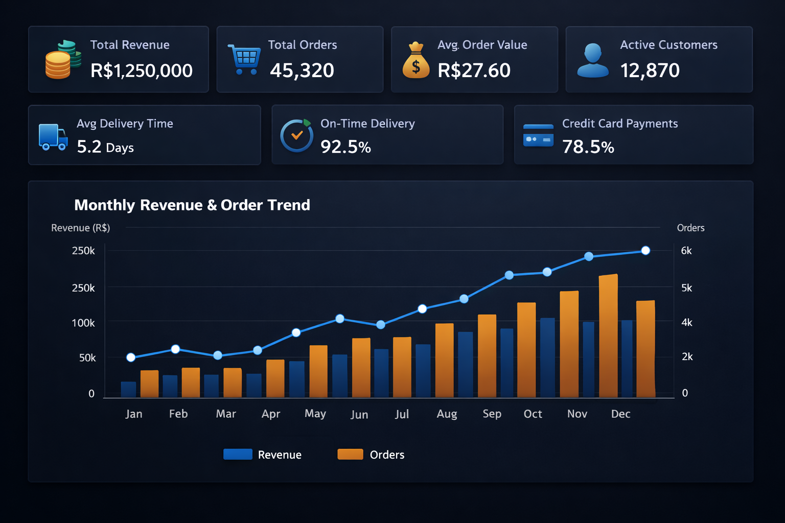
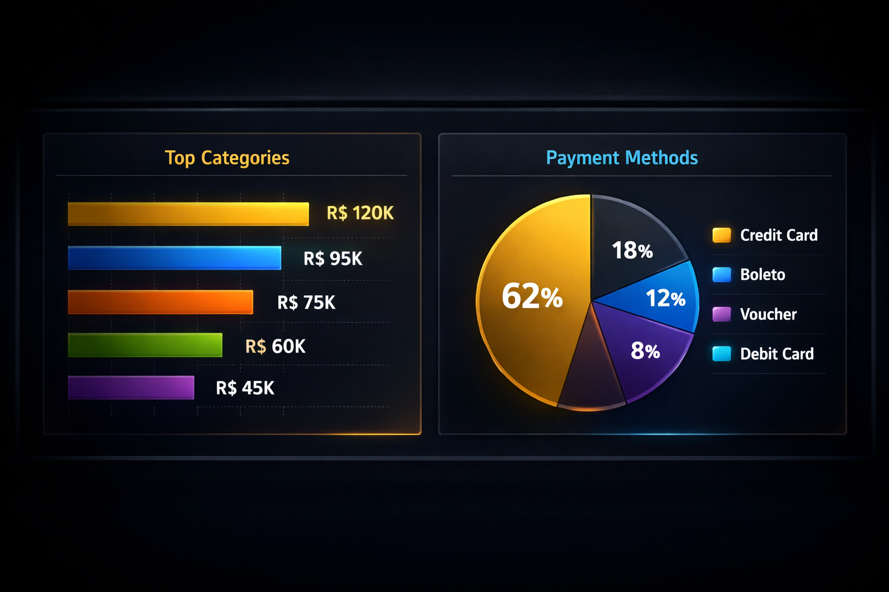
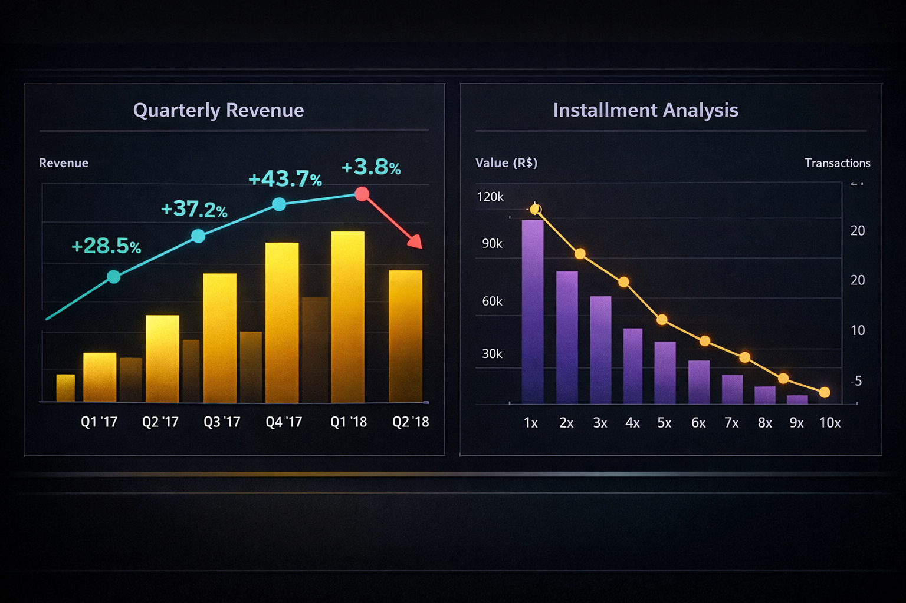
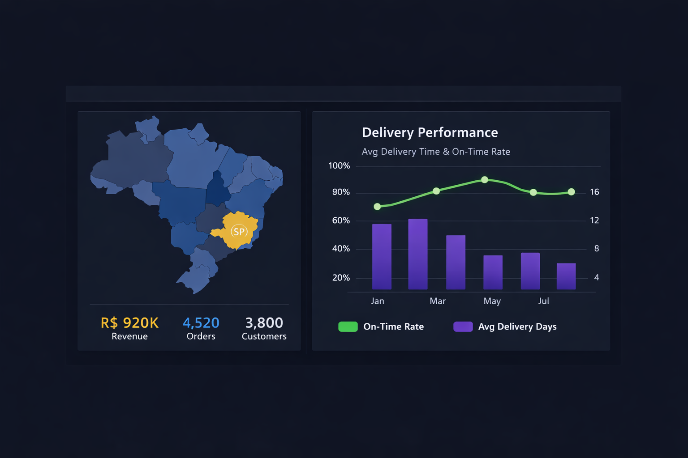
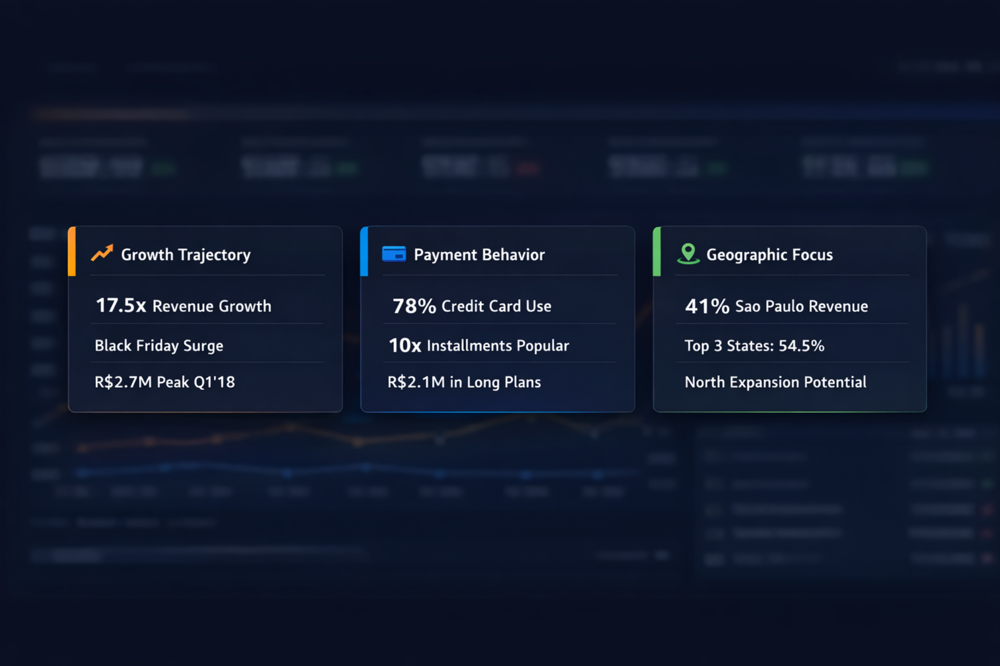
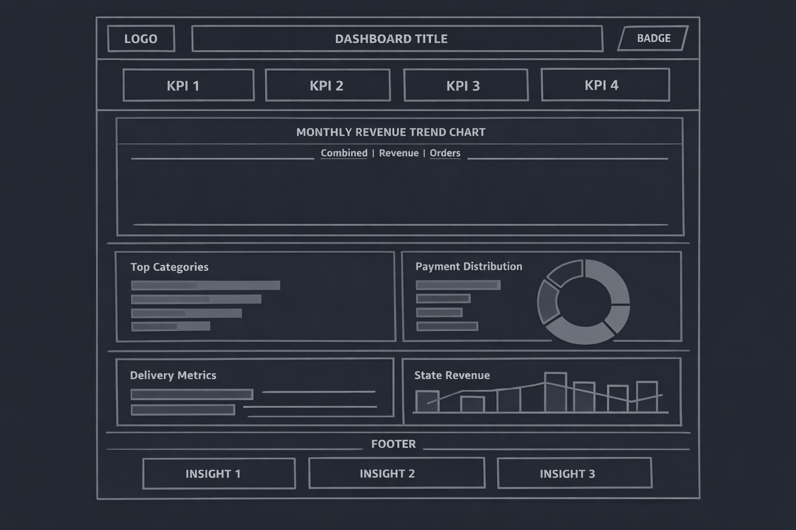

# Olist E-Commerce Financial Intelligence Dashboard

## Project Overview

This project presents an interactive financial analytics dashboard built on the **Olist Brazilian E‑Commerce** dataset — a real‑world transactional dataset comprising over 100,000 orders placed between 2016 and 2018 on the Olist marketplace, the largest department store platform in Brazilian e‑commerce.

The central question this dashboard addresses is: **What does the financial health of the Olist marketplace look like, and where are the biggest opportunities for revenue growth and operational improvement?**

I chose this topic because e‑commerce financial analytics sits at the intersection of several critical business domains — revenue analysis, payment behaviour, logistics performance and customer satisfaction — all of which directly impact strategic decision‑making. Rather than focusing on a single metric, this dashboard provides a holistic financial intelligence view that a CFO, COO or marketplace executive could use to identify growth levers, diagnose operational bottlenecks and make data‑driven investment decisions.

The dashboard covers R$15.4 million in gross merchandise value across 96,478 delivered orders, revealing patterns in revenue growth trajectory, payment method preferences, geographic concentration, category performance and the critical relationship between delivery speed and customer satisfaction.

---

## Data Source

**Dataset:** [Brazilian E‑Commerce Public Dataset by Olist](https://www.kaggle.com/datasets/olistbr/brazilian-ecommerce)  
**Platform:** Kaggle  
**License:** CC BY‑NC‑SA 4.0

The dataset consists of eight interconnected CSV files that form a relational schema:

| File | Records | Description |
|------|---------|-------------|
| `olist_orders_dataset.csv` | 99 441 | Core order metadata with timestamps and status |
| `olist_order_items_dataset.csv` | 112 650 | Line‑item details with price and freight |
| `olist_order_payments_dataset.csv` | 103 886 | Payment transactions (type, instalments, value) |
| `olist_order_reviews_dataset.csv` | 104 719 | Customer review scores and comments |
| `olist_customers_dataset.csv` | 99 441 | Customer geographic information |
| `olist_products_dataset.csv` | 32 951 | Product attributes and categories |
| `olist_sellers_dataset.csv` | 3 095 | Seller geographic information |
| `product_category_name_translation.csv` | 71 | Portuguese → English category names |

The data has been anonymised by Olist — all personal identifiers have been removed, and company/seller names have been replaced with fictional names from the *Game of Thrones* universe. Geographic coordinates have been rounded to city centroids for privacy. The financial values are in **Brazilian Reais (BRL / R$)** and represent real transaction amounts.

---

## Steps & Methodology

### Data Cleaning & Transformation

The analysis pipeline (`data_pipeline.py`) follows a structured ETL approach:

**Loading & Validation:** All eight CSV files are loaded and validated for structural integrity. Date columns across the orders dataset are parsed into proper `datetime` objects to enable temporal analysis.

**Filtering:** The dataset is filtered to include only delivered orders (`order_status == 'delivered'`), which represent completed financial transactions. This excludes cancelled, unavailable and in‑process orders that would distort revenue figures. This reduces the analysis to 96 478 orders from the original 99 441.

**Enrichment:** Order items are enriched with English product category names via the translation mapping table. A master financial table is constructed by joining orders, items, payments, customers and sellers — creating a single denormalised view with 112 000+ enriched transaction records.

**Time Bounding:** The analysis window is set to January 2017 through August 2018. The earliest months (late 2016) are excluded due to insufficient volume, and September 2018 is excluded as an incomplete month that would skew trend analysis.

### Analysis Approach

The analysis is structured around five financial pillars:

1. **Revenue Dynamics** — Monthly and quarterly revenue trends decomposed into product revenue and freight revenue, with quarter‑over‑quarter growth rates calculated to identify acceleration and deceleration patterns.
2. **Payment Intelligence** — Distribution analysis across four payment methods (credit card, boleto, voucher, debit card) with a deep dive into instalment plan preferences, revealing how Brazilian consumers finance their purchases.
3. **Category Performance** — Top 15 product categories ranked by gross revenue, with monthly trend analysis for the top five to identify seasonal patterns and emerging/declining categories.
4. **Geographic Distribution** — State‑level revenue concentration analysis revealing the dominance of the Southeast region and identifying underserved markets with growth potential.
5. **Operational Finance** — Delivery performance metrics (average delivery time and on‑time rate) tracked monthly as a proxy for operational cost efficiency and its impact on customer satisfaction scores.

### Tool Selection & Design Decisions

**Data Processing:** Python with Pandas for ETL — chosen for its flexibility in handling relational joins across eight tables and its robust datetime handling for temporal analysis.

**Visualisation:** Interactive HTML dashboard using Chart.js — selected to produce a self‑contained, deployable dashboard file that requires no server infrastructure. Chart.js provides smooth animations, responsive layouts and rich tooltip interactions.

**Design Philosophy:** The dashboard follows a dark‑theme financial terminal aesthetic inspired by Bloomberg Terminal and modern fintech dashboards. The design prioritises information density while maintaining visual clarity through careful use of colour hierarchy (gold for primary metrics, blue for secondary, green for positive indicators, red for negative).

**Typography:** *Space Mono* (monospace) for numerical values to ensure alignment and quick scanning, paired with *DM Sans* for labels and body text for readability.

---

## Dashboard Screenshots

### Full Dashboard — KPIs & Revenue Trend


### Category Performance & Payment Analysis


### Quarterly Growth & Instalment Analysis


### Geographic Distribution & Delivery Metrics


### Key Insights Panel


---

## Design Screenshots

### Wireframe — Dashboard Layout Planning


The dashboard layout follows an F‑pattern reading flow:

* **Top:** KPI cards for immediate executive summary
* **Middle‑Full:** Revenue trend chart (the most important visual) spans full width
* **Middle‑Split:** Category and payment charts side by side for comparative analysis
* **Bottom:** Geographic and operational metrics with tabular data for detail

Colour coding is consistent throughout: gold (₿) = revenue/primary, blue = secondary metrics, green = positive performance, purple = volume/count, red = negative indicators.

---

## Key Insights

**1. Explosive Growth with Plateau Risk:** Revenue grew 17.5× from Q3 2016 to Q1 2018, but growth decelerated sharply from 43.7% QoQ in Q4 2017 to just 3.8% in Q2 2018, before turning negative (–39.2%) in Q3 2018 (partial quarter). This suggests the marketplace is transitioning from hyper‑growth to maturation. A stakeholder should investigate whether the Q3 decline is seasonal or structural, and whether customer acquisition costs are rising.

**2. Black Friday is the Revenue Engine:** November 2017 generated R$987 K — a 52% spike over October — confirming Black Friday’s outsized impact on Brazilian e‑commerce. The recommendation is to invest in promotional infrastructure and inventory planning for Q4, potentially extending sales events (Black November) to smooth demand.

**3. Credit Card Instalments Drive Affordability:** 78.5% of revenue flows through credit cards, and within that, 67% of transactions use instalment plans. The 10‑instalment plan alone captures R$2.1 M — suggesting customers self‑select into the maximum payment stretch for large purchases. A stakeholder should consider promoting instalment options more prominently to increase average order value.

**4. Geographic Concentration is a Double‑Edged Sword:** São Paulo generates 41.4% of revenue, and the top three states (SP, RJ, MG) account for 54.5%. While this reflects Brazil’s economic geography, it creates concentration risk. The northern and northeastern regions (significant population bases) are severely underrepresented, presenting a clear expansion opportunity through targeted marketing and logistics network expansion.

**5. Delivery Speed Drives Satisfaction:** The average delivery time improved from 18.8 days (Feb 2017) to 10.1 days (May 2018), while the on‑time rate climbed from 80.5% to 95.3%. This operational improvement correlates with the 58.9% five‑star review rate. Continued logistics investment — particularly in underserved states where delivery times are likely longer — would compound both satisfaction and geographic expansion goals.

---

## Live Dashboard Link

🔗 **[Live Interactive Dashboard](https://olist-financial-dashboard-uyde5xvldxcm9xhd6cpv3n.streamlit.app)**
> The dashboard is deployed as an interactive web application. All charts support hover tooltips, and the revenue trend chart includes tab controls to toggle between combined view, revenue‑only, and orders‑only perspectives.

---

## Assumptions & Limitations

**Assumptions:**

* Only delivered orders are included in financial calculations. Cancelled and returned orders are excluded, which may understate the total transaction volume and overstate effective conversion rates.
* The `payment_value` field in the payments dataset is treated as gross revenue. It includes product price plus freight but excludes marketplace commissions, taxes and refunds — meaning true net revenue for Olist would be lower.
* Each unique `customer_id` is treated as a unique customer. The dataset notes that the same physical customer may have different IDs across orders, so the true unique customer count is likely lower (repeat purchase rate is understated).

**Limitations:**

* The dataset covers only January 2017 through August 2018, limiting the ability to identify long‑term secular trends or multi‑year seasonality patterns.
* Product‑level margins are not available, so revenue analysis is limited to gross merchandise value without profitability insights.
* The Q3 2018 decline may reflect dataset truncation rather than an actual business downturn, as August 2018 appears to be the final complete month of data.
* Geographic analysis is at the state level only; city‑level analysis would reveal more nuanced distribution patterns but would require more complex visualisation.
* The dataset is anonymised, so it’s not possible to link this analysis to actual Olist business outcomes or validate findings against reported company financials.

---

## Repository Structure

```
olist-financial-dashboard/
├── README.md                          # This document
├── data/                              # Raw datasets (placeholder sample data)
│   ├── olist_orders_dataset.csv
│   ├── olist_order_items_dataset.csv
│   ├── olist_order_payments_dataset.csv
│   ├── olist_order_reviews_dataset.csv
│   ├── olist_customers_dataset.csv
│   ├── olist_products_dataset.csv
│   ├── olist_sellers_dataset.csv
│   └── product_category_name_translation.csv
├── data_pipeline.py                   # Python ETL & analysis script
├── dashboard.html                     # Interactive dashboard (self‑contained)
├── output/
│   └── dashboard_data.json            # Processed data for dashboard
├── screenshots/                       # Dashboard screenshots
│   ├── dashboard-kpis-revenue.png
│   ├── dashboard-categories-payments.png
│   ├── dashboard-quarterly-installments.png
│   ├── dashboard-states-delivery.png
│   └── dashboard-insights.png
├── design/                            # UI/UX design files
│   └── wireframe-layout.png
└── streamlit_app.py                   # Streamlit deployment version
```

---

## How to Run

### Static Dashboard (No Dependencies)

Simply open `dashboard.html` in any modern web browser. The dashboard is fully self‑contained with all data embedded and Chart.js loaded via CDN.

### Python Pipeline

```bash
pip install pandas numpy
python data_pipeline.py
```

### Streamlit Live Dashboard

```bash
pip install streamlit pandas plotly
streamlit run streamlit_app.py
```

---

*Built by IBRAHEM · February 2026*  
*Data Source: [Olist Brazilian E‑Commerce Dataset](https://www.kaggle.com/datasets/olistbr/brazilian-ecommerce) (Kaggle)*
